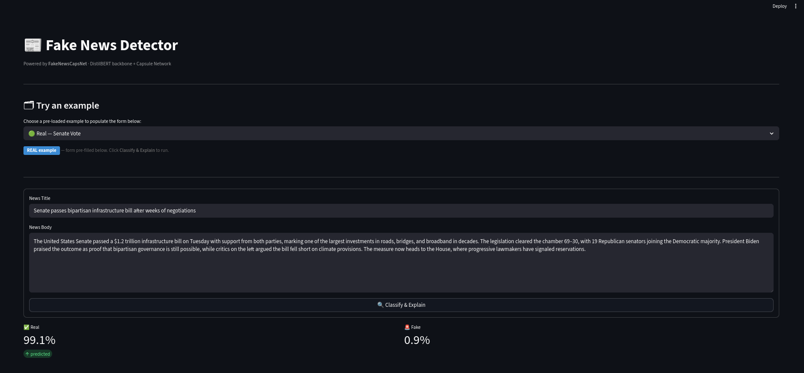
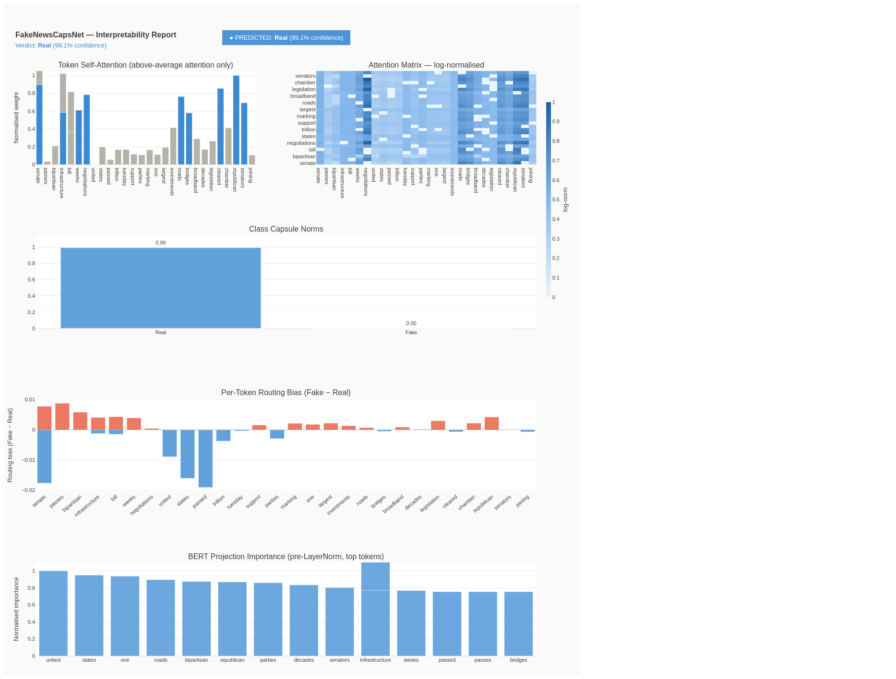

# AI-Powered-Fake-News-Detection


In an increasingly dynamic world, information
reaches us with impressive speed. Social me-
dia, newsletters, and news programs keep us
perpetually connected to global events. How-
ever, this connectivity has a downside: the
rapid rise of disinformation. Technologies like
Generative AI can now create realistic news
stories that lack verifiable facts, sources, or
quotes.
This is particularly problematic on social
media, where research suggests a significant
portion of content is not based on factual data.
Even the most sophisticated algorithms strug-
gle to distinguish between real, AI-generated,
and fake news. When these systems fail or
produce ”false positives” their ”black-box” na-
ture means they rarely provide a reason for
their classification. To address this, we have
developed a model that is both more accurate
and more transparent, identifying the specific
parts of an article that drive its conclusions.


The model was trained and evaluated on the [WELFake Dataset](https://www.kaggle.com/datasets/saurabhshahane/fake-news-classification) (Word Embedding over Linguistic Features for Fake News Detection).
* *Total Records:* ~72,000 balanced articles (Political, Global Crises, Social Issues).
* *Test Accuracy:* **97.87%** (14,120 / 14,428 correct).
* *Macro F1-Score:* 0.98.

Here, you can find our last model checkpoint on [HugginFace](https://huggingface.co/LuckyMan123/caps-new-with-attention/resolve/main/best_epoch_model-v2-2.pt)

## Installation & Setup

1. **Clone the repository:**
   ```bash
   git clone [https://github.com/Erre17/AI-Powered-Fake-News-Detection.git](https://github.com/Erre17/AI-Powered-Fake-News-Detection.git)
   ```
2. **Move the model checkpoint in the directory:** 
 ```bash
   mv best_epoch_model-v2-2.pt FakeNewsCapsNet/best_epoch_model-v2.pt
   cd FakeNewsCapsNet
   ```
3. **Set up the new environment :**  
 ```bash

   python3 -m venv venv
   source venv/bin/activate
   pip3 install -r requirements.txt
   ```
4. **Run the application:**  
 ```bash
   streamlint run app.py
```


